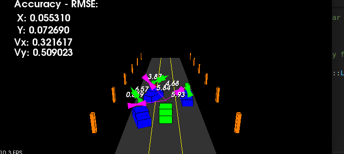
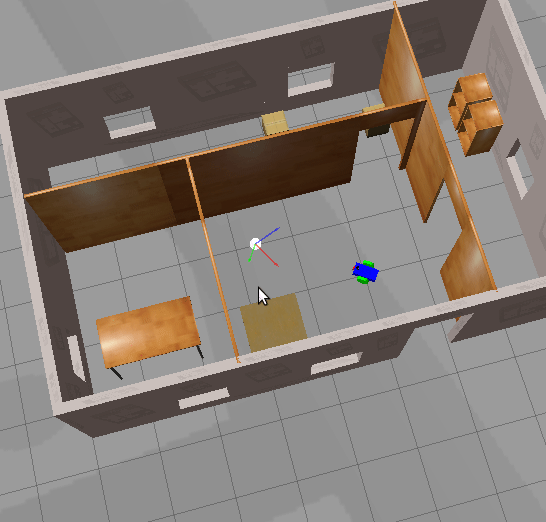
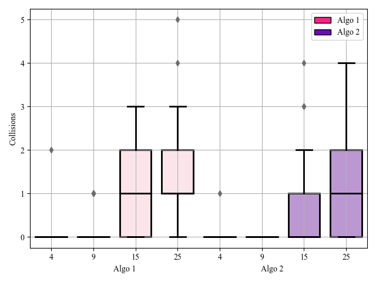

<table>
<tr>
<td style="width: 70%;">
    
## Hi there 👋  I'm Ritika A. 
**Robotics Engineer | Sensor Fusion & ADAS Engineer**  

📍 California, USA  
📧 [ritikakgp2609@gmail.com](mailto:ritikakgp2609@gmail.com)  
🔗 [LinkedIn](https://linkedin.com/in/ritikaavadha/) | [GitHub](https://github.com/rtkartista) | [Portfolio](https://sites.google.com/oregonstate.edu/ritikaavadhanula)  

### 🔭 I’m currently working on  
- Enhancing ADAS Highway features in the **Automotive** domain and improving my skills in **4D perception** and **Visual SLAM**

### 👯 I’m looking to collaborate on  
- Open-source projects in **SLAM**, **Sensor Fusion**, and **Multi-Robot Systems**.  
- Cutting-edge research in **Robot Localization** and **Collision Prediction** algorithms.  

### 💬 Ask me about  
- Sensor Fusion for self-driving cars.  
- Developing efficient SLAM pipelines.  
- Leveraging AI for robotics applications.

### ⚡ Fun fact  
I love swimming and exploring local cafes! If you’re up for a short hike, count me in. 🚶‍♀️☕✨  

 Feel free to explore my repos and connect to collab or discuss robotics, sensor fusion, or exciting tech challenges in ML!  

</td>
<td align="center">
    
### 🤖 Past projects
- 
- 
- 
- 

</td>
</tr>
</table>

